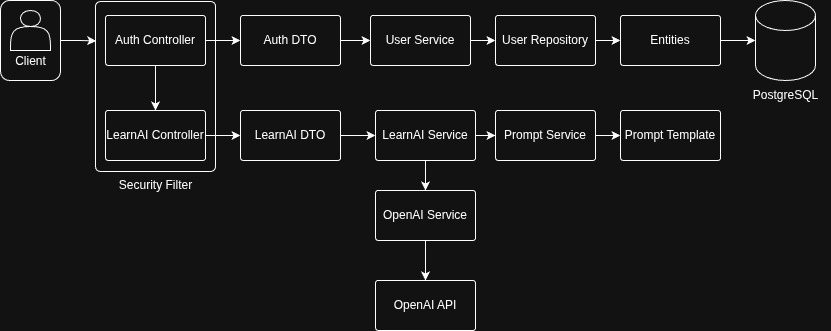

# LearnAI API
Projeto de backend em Java com Spring Boot para geração de conteúdos educacionais com IA, autenticação JWT e documentação automática via Swagger.

# Funcionalidades
- Cadastro e autenticação de usuários (JWT)
- Endpoint protegido para geração de conteúdo de aprendizado
- Integração com OpenAI
- Documentação automática da API com Swagger (OpenAPI)

# Estrutura do Projeto


# Instalação
## 1. Clone o repositório
```
git clone https://github.com/igrrsantos/learnai.git
cd learnai
```
## 2. Configure as variáveis de ambiente
Configure o arquivo ``src/main/resources/application.properties`` com:
```
jwt.secret=uma-chave-secreta-segura-aqui
jwt.expiration=86400000
openai.api.key=sua-api-key-openai
openai.api.url=https://api.openai.com/v1/chat/completions
openai.model=gpt-4.1-nano
```
## 3. Instale as dependências e rode o projeto
```
mvn clean package
mvn spring-boot:run
```

# Rodando com Docker
## 1. Configure as variáveis de ambiente
   O projeto já possui um arquivo ``Dockerfile`` e ``docker-compose.yml``.
## 2. Build da imagem Docker
```
docker build -t learnai-api .
```
## 3. Rode o container passando as variáveis necessárias:
```
docker run -d \
  -p 8080:8080 \
  -e JWT_SECRET="uma-chave-secreta-segura-aqui" \
  -e JWT_EXPIRATION=86400000 \
  -e OPENAI_API_KEY="sua-api-key-openai" \
  --name learnai-api \
  learnai-api
```
- Substitua os valores das variáveis conforme necessário.
- O serviço ficará disponível em ``http://localhost:8080``.

## 4. Depois basta rodar:
``docker-compose up -d``

# Uso
## Cadastro de Usuário

Endpoint: ``POST /api/auth/register``

### Body JSON:
```
{
  "email": "usuario@exemplo.com",
  "password": "senha123"
}
```

## Login
Endpoint: POST /api/auth/login

### Body JSON:
```
{
"email": "usuario@exemplo.com",
"password": "senha123"
}
```
### Resposta:
```
{
"token": "eyJhbGciOiJIUzI1NiJ9..."
}
```

# Gerar Conteúdo de Aprendizado
Endpoint protegido: ```POST /api/learnai```

### Headers:
```
Authorization: Bearer <token_jwt>
Content-Type: application/json
```

### Body JSON:
```
{
"topic": "Revolução Francesa",
"level": "intermediario"
}
```

## Documentação Swagger
Acesse após iniciar a aplicação:

http://localhost:8080/swagger-ui.html

ou

http://localhost:8080/swagger-ui/index.html

## Segurança
- Todos os endpoints, exceto cadastro, login e documentação Swagger, exigem autenticação JWT.

- O token JWT deve ser enviado no header Authorization.

## Personalização
- Para modificar prompts, altere o arquivo src/main/resources/prompts/learnai-prompt.txt.

- Para aumentar o tempo de expiração do token, ajuste o parâmetro jwt.expiration em application.properties.